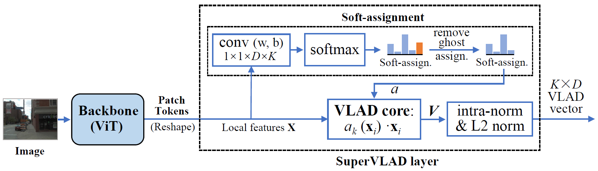

# SuperVLAD
This is the official repository for the NeurIPS 2024 paper "[SuperVLAD: Compact and Robust Image Descriptors for Visual Place Recognition](https://proceedings.neurips.cc/paper_files/paper/2024/hash/0b135d408253205ba501d55c6539bfc7-Abstract-Conference.html)".



## Getting Started

This repo follows the framework of [GSV-Cities](https://github.com/amaralibey/gsv-cities) for training, and the [Visual Geo-localization Benchmark](https://github.com/gmberton/deep-visual-geo-localization-benchmark) for evaluation. You can download the GSV-Cities datasets [HERE](https://www.kaggle.com/datasets/amaralibey/gsv-cities), and refer to [VPR-datasets-downloader](https://github.com/gmberton/VPR-datasets-downloader) to prepare test datasets.

The test dataset should be organized in a directory tree as such:

```
├── datasets_vg
    └── datasets
        └── pitts30k
            └── images
                ├── train
                │   ├── database
                │   └── queries
                ├── val
                │   ├── database
                │   └── queries
                └── test
                    ├── database
                    └── queries
```

Before training, you should download the pre-trained foundation model DINOv2(ViT-B/14) [HERE](https://dl.fbaipublicfiles.com/dinov2/dinov2_vitb14/dinov2_vitb14_pretrain.pth).

## Train
```
python3 train.py --eval_datasets_folder=/path/to/your/datasets_vg/datasets --eval_dataset_name=msls --foundation_model_path=/path/to/pre-trained/dinov2_vitb14_pretrain.pth --backbone=dino --supervlad_clusters=4 --crossimage_encoder --patience=3 --lr=0.00005 --epochs_num=20 --train_batch_size=120 --freeze_te=8
```

## Adversarial Train
```
python3 adv_train.py --eval_datasets_folder=/path/to/your/datasets_vg/datasets --eval_dataset_name=msls --foundation_model_path=/path/to/pre-trained/dinov2_vitb14_pretrain.pth --backbone=dino --supervlad_clusters=4 --crossimage_encoder --patience=3 --lr=0.00005 --epochs_num=20 --train_batch_size=120 --freeze_te=8 --adv_epsilon=0.001 --adv_steps=3 --adv_loss_weight=1.0 --adv_align_weight=0.05 --adv_negatives=5
```

To adversarially fine-tune the current SuperVLAD checkpoint instead of training from scratch, resume from `checkpoints/SuperVLAD.pth` and point the script to the GSV-Cities training set used for optimization. When fine-tuning a converged checkpoint, prefer `--resume_model_only` so the adversarial run starts with fresh optimizer and early-stopping state instead of inheriting the clean-training state:

```
python3 adv_train.py --eval_datasets_folder=/path/to/your/datasets_vg/datasets --gsv_cities_base_path=/path/to/your/gsv_cities --eval_dataset_name=msls --resume=checkpoints/SuperVLAD.pth --resume_model_only --foundation_model_path=/path/to/pre-trained/dinov2_vitb14_pretrain.pth --backbone=dino --supervlad_clusters=4 --crossimage_encoder --patience=3 --lr=0.00005 --epochs_num=20 --train_batch_size=120 --freeze_te=8 --adv_epsilon=0.001 --adv_steps=3 --adv_loss_weight=1.0 --adv_align_weight=0.05 --adv_negatives=5
```

If `--gsv_cities_base_path` is omitted, the script will try `$GSV_CITIES_BASE_PATH` and then `<eval_datasets_folder>/gsv_cities`.

With the current DINO-based training script, `--foundation_model_path` is still required when resuming because the backbone is constructed before the checkpoint weights are loaded.

To monitor training with TensorBoard:

```
tensorboard --logdir logs
```

## Test
```
python3 eval.py --eval_datasets_folder=/path/to/your/datasets_vg/datasets --eval_dataset_name=msls --resume=/path/to/trained/model/SuperVLAD.pth --backbone=dino --supervlad_clusters=4 --crossimage_encoder --infer_batch_size=8
```

## FGSM Robustness Evaluation
Use `fgsm_eval.py` to evaluate one clean run and one attacked run for each epsilon value that you provide. The script keeps the database descriptors clean, perturbs only query images, and saves a JSON report with the command, arguments, attack configuration, and recall metrics.

If an FGSM evaluation was interrupted, pass `--resume_eval_dir` with a previous run directory such as `test/default/2026-04-18_04-41-30`. The script will read completed `Clean recalls` and `FGSM eps=...` entries from that directory's `info.log`, skip those finished runs, append the remaining logs to the same directory, and then write `fgsm_eval_results.json` there.

Supported FGSM objectives:

- `positive_distance`: move each query descriptor away from a true positive database match.
- `wrong_match`: make each query descriptor more similar to a nearby wrong database match while reducing similarity to a true positive.
- `training_style`: use a lightweight triplet-style ranking loss with one positive and the nearest non-positive descriptors.

The FGSM script currently supports `--test_method hard_resize`, `single_query`, and `central_crop`.

Example with one clean run and multiple epsilon values:

```
python3 fgsm_eval.py --eval_datasets_folder=datasets --eval_dataset_name=msls --resume=checkpoints/SuperVLAD.pth --backbone=dino --supervlad_clusters=4 --crossimage_encoder --infer_batch_size=32 --epsilons 0.00001 0.0001 0.001 --fgsm_loss positive_distance
```

Example resume command:

```
python3 fgsm_eval.py --eval_datasets_folder=datasets --eval_dataset_name=msls --resume=checkpoints/SuperVLAD.pth --backbone=dino --supervlad_clusters=4 --crossimage_encoder --infer_batch_size=32 --epsilons 0.00001 0.0001 0.001 --fgsm_loss positive_distance --resume_eval_dir test/default/2026-04-18_04-41-30
```

## SuperVLAD without cross-image encoder

Remove parameter `--crossimage_encoder` to run the SuperVLAD without cross-image encoder.

## 1-cluster VLAD

Set `--supervlad_clusters=1` and `--ghost_clusters=2` to run the 1-cluster VLAD. For example,

```
python3 eval.py --eval_datasets_folder=/path/to/your/datasets_vg/datasets --eval_dataset_name=msls --resume=/path/to/trained/model/1-clusterVLAD.pth --backbone=dino --supervlad_clusters=1 --ghost_clusters=2
```

## Training with Automatic Mixed Precision

If you want to train models with Automatic Mixed Precision for faster training speed and less GPU memory usage. Just add parameter `--mixed_precision`. In this case, the cross-image encoder is not optimized separately and may not perform well.

## Trained Model

<table style="margin: auto">
  <thead>
    <tr>
      <th>model</th>
      <th>cross-image<br />encoder</th>
      <th>download</th>
    </tr>
  </thead>
  <tbody>
    <tr>
      <td>SuperVLAD</td>
      <td align="center">:white_check_mark:</td>
      <td><a href="https://drive.google.com/file/d/1yomnWGTJko6nf3F2Ju6RWsLhP2EG82tL/view?usp=drive_link">LINK</a></td>
    </tr>
    <tr>
      <td>SuperVLAD</td>
      <td align="center">:x:</td>
      <td><a href="https://drive.google.com/file/d/1wRkUO4E8s5hNRNNIWcuA8RUvlGob3Tbf/view?usp=drive_link">LINK</a></td>
    </tr>
    <tr>
      <td>1-ClusterVLAD</td>
      <td align="center">:x:</td>
      <td><a href="https://drive.google.com/file/d/1pQcJx9n2-keAh9TttssZkz6D0vjpFWU6/view?usp=drive_link">LINK</a></td>
    </tr>
  </tbody>
</table>

## Acknowledgements

Parts of this repo are inspired by the following repositories:

[GSV-Cities](https://github.com/amaralibey/gsv-cities)

[Visual Geo-localization Benchmark](https://github.com/gmberton/deep-visual-geo-localization-benchmark)

[DINOv2](https://github.com/facebookresearch/dinov2)

## Citation

If you find this repo useful for your research, please cite the paper

```
@inproceedings{lu2024supervlad,
  title={SuperVLAD: Compact and Robust Image Descriptors for Visual Place Recognition},
  author={Lu, Feng and Zhang, Xinyao and Ye, Canming and Dong, Shuting and Zhang, Lijun and Lan, Xiangyuan and Yuan, Chun},
  booktitle={Advances in Neural Information Processing Systems},
  volume={37},
  pages={5789--5816},
  year={2024}
}
```
